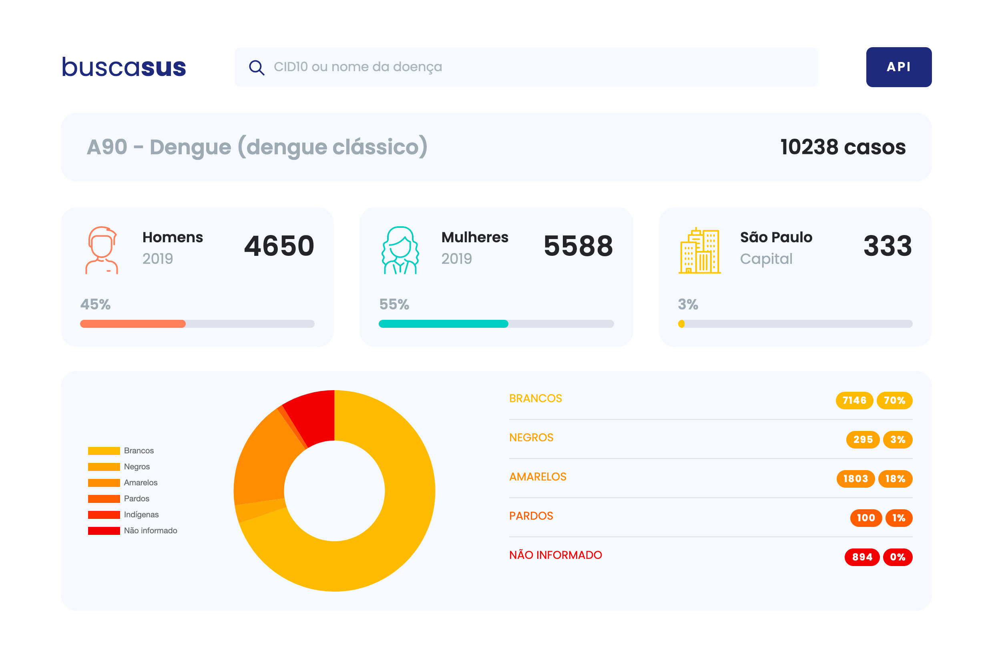

# BuscaSUS
[buscasus.com.br](https://buscasus.com.br)

Aplicação desenvolvida para o desafio da SANOFI e FIAP.

## Equipe
- [Hugo Fabricio](https://linkedin.com/in/hugo-fabriicio)
- [Paula Pompeo](https://linkedin.com/in/paulapompeo/)
- [Tamires de Lima](https://linkedin.com/in/tamiresdelima/)
- [Ana Carolina](https://linkedin.com/in/ana-carolina-almeida-5b957b182/)
- [Diego Scagnolato](https://linkedin.com/in/diego-decio-scagnolato/)

## Frontend
- GatsbyJS
- Styled Components
- Algolia InstantSearch

## API
- NestJS
- MongoDB
- Algolia

## Retornar lista de CIDS10

### Request

`GET /cids`

    curl -i -H 'Accept: application/json' https://buscasus.com.br/api/cids

### Response

    {
      "results": [
        {
          "statistics": [
            {
              "cost_year": 35.95,
              "cost_per_case": 35.95,
              "age": 66,
              "mortality": 1,
              "mortality_rate": 1,
              "days_hospitalized": 4,
              "cases": 1,
              "cases_female": null,
              "cases_male": 1,
              "cases_sp": null,
              "cases_undefined_gender": null,
              "cases_white": 1,
              "cases_black": null,
              "cases_yellow": null,
              "cases_brown": null,
              "cases_indigenous": null,
              "cases_undefined_race": null,
              "percent_female": null,
              "percent_male": 100,
              "percent_sp": null,
              "percent_white": 100,
              "percent_black": null,
              "percent_yellow": null,
              "percent_brown": null,
              "percent_indigenous": null,
              "_id": "5fbb139dcce1ba1b07a89522",
              "cid": "A00",
              "year": "2019",
              "disease": "5fbb12a196314c1acb8c0352",
              "__v": 0
            }
          ],
          "_id": "5fbb12a196314c1acb8c0352",
          "cid": "A00",
          "name": "Cólera",
          "__v": 1
        }
      ]
    }

## Retorna um CID10 e suas estátisticas

### Request

`GET /cids/{cid}`

    curl -i -H 'Accept: application/json' https://buscasus.com.br/api/cids/A00

### Response

    {
      "statistics": [
        {
          "cost_year": 35.95,
          "cost_per_case": 35.95,
          "age": 66,
          "mortality": 1,
          "mortality_rate": 1,
          "days_hospitalized": 4,
          "cases": 1,
          "cases_female": null,
          "cases_male": 1,
          "cases_sp": null,
          "cases_undefined_gender": null,
          "cases_white": 1,
          "cases_black": null,
          "cases_yellow": null,
          "cases_brown": null,
          "cases_indigenous": null,
          "cases_undefined_race": null,
          "percent_female": null,
          "percent_male": 100,
          "percent_sp": null,
          "percent_white": 100,
          "percent_black": null,
          "percent_yellow": null,
          "percent_brown": null,
          "percent_indigenous": null,
          "_id": "5fbb139dcce1ba1b07a89522",
          "cid": "A00",
          "year": "2019",
          "disease": "5fbb12a196314c1acb8c0352",
          "__v": 0
        }
      ],
      "_id": "5fbb12a196314c1acb8c0352",
      "cid": "A00",
      "name": "Cólera",
      "__v": 1
    }

## Retorna as estátisticas de um determinado CID10

### Request

`GET /statistics/{cid}`

    curl -i -H 'Accept: application/json' https://buscasus.com.br/api/statistics/A00

### Response

    {
      "results": [
        {
          "cost_year": 35.95,
          "cost_per_case": 35.95,
          "age": 66,
          "mortality": 1,
          "mortality_rate": 1,
          "days_hospitalized": 4,
          "cases": 1,
          "cases_female": null,
          "cases_male": 1,
          "cases_sp": null,
          "cases_undefined_gender": null,
          "cases_white": 1,
          "cases_black": null,
          "cases_yellow": null,
          "cases_brown": null,
          "cases_indigenous": null,
          "cases_undefined_race": null,
          "percent_female": null,
          "percent_male": 100,
          "percent_sp": null,
          "percent_white": 100,
          "percent_black": null,
          "percent_yellow": null,
          "percent_brown": null,
          "percent_indigenous": null,
          "_id": "5fbb139dcce1ba1b07a89522",
          "cid": "A00",
          "year": "2019",
          "disease": {
            "_id": "5fbb12a196314c1acb8c0352",
            "name": "Cólera"
          },
          "__v": 0
        }
      ]
    }

## Retorna as estátisticas de um determinado ano de um CID10

### Request

`GET /statistics/{cid}/{year}`

    curl -i -H 'Accept: application/json' https://buscasus.com.br/api/statistics/A00/2019

### Response

    {
      "cost_year": 35.95,
      "cost_per_case": 35.95,
      "age": 66,
      "mortality": 1,
      "mortality_rate": 1,
      "days_hospitalized": 4,
      "cases": 1,
      "cases_female": null,
      "cases_male": 1,
      "cases_sp": null,
      "cases_undefined_gender": null,
      "cases_white": 1,
      "cases_black": null,
      "cases_yellow": null,
      "cases_brown": null,
      "cases_indigenous": null,
      "cases_undefined_race": null,
      "percent_female": null,
      "percent_male": 100,
      "percent_sp": null,
      "percent_white": 100,
      "percent_black": null,
      "percent_yellow": null,
      "percent_brown": null,
      "percent_indigenous": null,
      "_id": "5fbb139dcce1ba1b07a89522",
      "cid": "A00",
      "year": "2019",
      "disease": {
        "_id": "5fbb12a196314c1acb8c0352",
        "name": "Cólera"
      },
      "__v": 0
    }